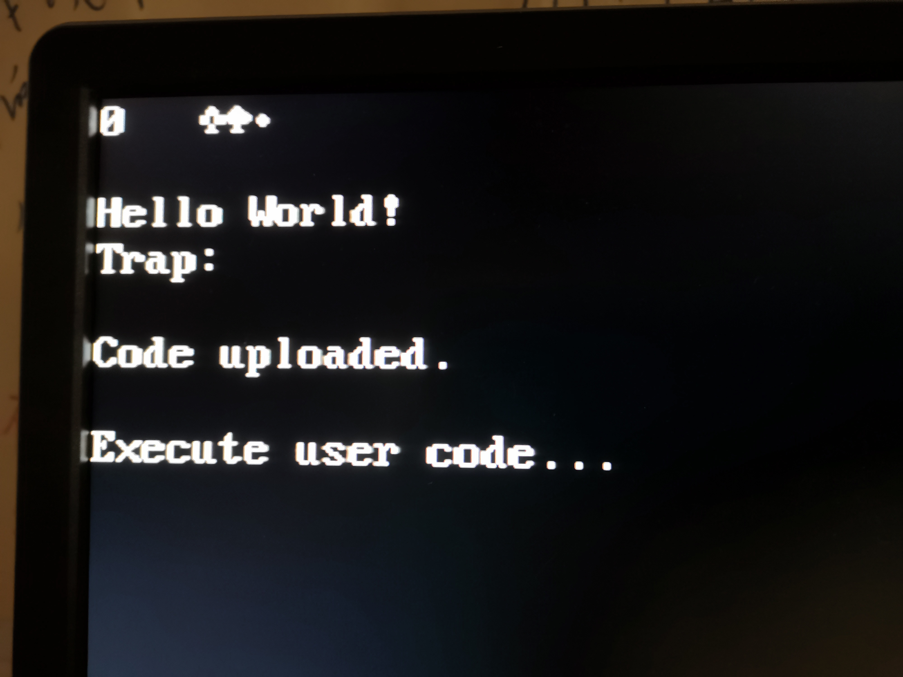

# soc1_bootloader
bootloader C code for soc1 project

## Memory layout
soc1.h
``````````
#ifndef _SOC1_H_
#define _SOC1_H_
//-----------------------------------------------------------------------------//
// not vector, 32-bit branch instruction
#define SYS_RESET		0x0000
#define SYS_TRAP		0x0004
//-----------------------------------------------------------------------------//

// Global data
#define CURSOR_POS		0x0010  // cursor position used by reset and trap
#define USER_KEY_HANDLER	0x0014  // set by the user code
#define USER_CODE_SIZE		0x0018
#define USER_CODE_LOADED	0x001C  // 0 no, 1 yes
// tmp for bootloader
#define BYTE_RECEIVED		0x0020
#define DWORD_CNT		0x0024
#define DWORD_TMP		0x0028


#define SYS_START		0x0000
#define SYS_END			0x0FFF
#define SYS_STACK		SYS_END

#define USER_START		0x01000
#define USER_END		0x0FFFF
#define USER_STACK		USER_END

//-----------------------------------------------------------------------------//
#define TEXT_VIDEO_RAM_START	0x10000
#define TEXT_VIDEO_RAM_END	0x107FF
#define UARTDR			0x21000
//-----------------------------------------------------------------------------//
#define TEXT_COLUMN		80
#define TEXT_ROW		30
//-----------------------------------------------------------------------------//
#endif
``````````

`````````
__attribute__((naked))
void takesomespace (void)
{
        // .byte .word .long
        asm("beq x0, x0, reset_stub");         // 0x0000
        asm("beq x0, x0, trap_stub");          // 0x0004                
        asm __volatile__ (".long 0x00000000"); // 0x0008
        asm __volatile__ (".long 0x00000000"); // 0x000c
        asm __volatile__ (".long 0x00010000"); // 0x0010   CURSOR_POS
        asm __volatile__ (".long 0x00000000"); // 0x0014   USER_KEY_HANDLER
        asm __volatile__ (".long 0x00000400"); // 0x0018   USER_CODE_SIZE  1kb
        asm __volatile__ (".long 0x00000000"); // 0x001C   USER_CODE_LOADED
        asm __volatile__ (".long 0x00000000"); // 0x0020   BYTE_RECEIVED
        asm __volatile__ (".long 0x00000000"); // 0x0024   DWORD_CNT
        asm __volatile__ (".long 0x00000000"); // 0x0028   DWORD_TMP
                                               // 0x002C
}
`````````

* 0x0000 reset entry
* 0x0004 trap entry

The rest are some global variables.


## How to create the bootloader
After compiling the project, disassemble it using objdump. Put the following output into ram.mif.

Then change the line number and comments out all unnecessary content.

``````````
[uty@u soc1_bootloader]$ riscv32-unknown-linux-gnu-objdump -D -M no-aliases loader

loader:     file format elf32-littleriscv


Disassembly of section .text:

00000000 <takesomespace>:
   0:	02000863          	beq	zero,zero,30 <reset_stub>
   4:	02000e63          	beq	zero,zero,40 <trap_stub>
	...
  10:	0000                	c.unimp
  12:	0001                	c.addi	zero,0
  14:	0000                	c.unimp
  16:	0000                	c.unimp
  18:	0400                	c.addi4spn	s0,sp,512
	...
  2a:	0000                	c.unimp
  2c:	00000013          	addi	zero,zero,0

00000030 <reset_stub>:
  30:	0ff00113          	addi	sp,zero,255
  34:	00511113          	slli	sp,sp,0x5
  38:	024000ef          	jal	ra,5c <reset>
  3c:	0000006f          	jal	zero,3c <reset_stub+0xc>

00000040 <trap_stub>:
  40:	ff810113          	addi	sp,sp,-8
  44:	00112223          	sw	ra,4(sp)
  48:	088000ef          	jal	ra,d0 <trap>
  4c:	00412083          	lw	ra,4(sp)
  50:	00810113          	addi	sp,sp,8
  54:	30200073          	mret
  58:	00000013          	addi	zero,zero,0

0000005c <reset>:
  5c:	ff010113          	addi	sp,sp,-16
  60:	00112623          	sw	ra,12(sp)
  64:	00812423          	sw	s0,8(sp)
  68:	01010413          	addi	s0,sp,16
  6c:	00000593          	addi	a1,zero,0
  70:	00200513          	addi	a0,zero,2
  74:	33c000ef          	jal	ra,3b0 <set_cursor_pos>
  78:	44c02783          	lw	a5,1100(zero) # 44c <hellostring>
  7c:	00c00593          	addi	a1,zero,12
  80:	00078513          	addi	a0,a5,0
  84:	288000ef          	jal	ra,30c <print_string>
  88:	000017b7          	lui	a5,0x1
  8c:	80078793          	addi	a5,a5,-2048 # 800 <executestring+0x3a8>
  90:	30479073          	csrrw	zero,mie,a5
  94:	30045073          	csrrwi	zero,mstatus,8
  98:	01c00793          	addi	a5,zero,28
  9c:	0007a703          	lw	a4,0(a5)
  a0:	00100793          	addi	a5,zero,1
  a4:	fef71ae3          	bne	a4,a5,98 <reset+0x3c>
  a8:	00000593          	addi	a1,zero,0
  ac:	00700513          	addi	a0,zero,7
  b0:	300000ef          	jal	ra,3b0 <set_cursor_pos>
  b4:	45802783          	lw	a5,1112(zero) # 458 <executestring>
  b8:	01400593          	addi	a1,zero,20
  bc:	00078513          	addi	a0,a5,0
  c0:	24c000ef          	jal	ra,30c <print_string>
  c4:	000017b7          	lui	a5,0x1
  c8:	000780e7          	jalr	ra,0(a5) # 1000 <executestring+0xba8>
  cc:	fcdff06f          	jal	zero,98 <reset+0x3c>

000000d0 <trap>:
  d0:	fd010113          	addi	sp,sp,-48
  d4:	02112623          	sw	ra,44(sp)
  d8:	02812423          	sw	s0,40(sp)
  dc:	03010413          	addi	s0,sp,48
  e0:	fc042e23          	sw	zero,-36(s0)
  e4:	fe042623          	sw	zero,-20(s0)
  e8:	fe042423          	sw	zero,-24(s0)
  ec:	fe042223          	sw	zero,-28(s0)
  f0:	fe042023          	sw	zero,-32(s0)
  f4:	000217b7          	lui	a5,0x21
  f8:	0007a783          	lw	a5,0(a5) # 21000 <executestring+0x20ba8>
  fc:	fcf42e23          	sw	a5,-36(s0)
 100:	01c00793          	addi	a5,zero,28
 104:	0007a703          	lw	a4,0(a5)
 108:	00100793          	addi	a5,zero,1
 10c:	02f71063          	bne	a4,a5,12c <trap+0x5c>
 110:	01400793          	addi	a5,zero,20
 114:	0007a783          	lw	a5,0(a5)
 118:	1e078063          	beq	a5,zero,2f8 <trap+0x228>
 11c:	01400793          	addi	a5,zero,20
 120:	0007a783          	lw	a5,0(a5)
 124:	000780e7          	jalr	ra,0(a5)
 128:	1d40006f          	jal	zero,2fc <trap+0x22c>
 12c:	00000593          	addi	a1,zero,0
 130:	00300513          	addi	a0,zero,3
 134:	27c000ef          	jal	ra,3b0 <set_cursor_pos>
 138:	45002783          	lw	a5,1104(zero) # 450 <trapstring>
 13c:	00600593          	addi	a1,zero,6
 140:	00078513          	addi	a0,a5,0
 144:	1c8000ef          	jal	ra,30c <print_string>
 148:	00800593          	addi	a1,zero,8
 14c:	00300513          	addi	a0,zero,3
 150:	260000ef          	jal	ra,3b0 <set_cursor_pos>
 154:	fdc40793          	addi	a5,s0,-36
 158:	00100593          	addi	a1,zero,1
 15c:	00078513          	addi	a0,a5,0
 160:	1ac000ef          	jal	ra,30c <print_string>
 164:	01800793          	addi	a5,zero,24
 168:	0007a783          	lw	a5,0(a5)
 16c:	fef42623          	sw	a5,-20(s0)
 170:	02800793          	addi	a5,zero,40
 174:	fef42423          	sw	a5,-24(s0)
 178:	02400793          	addi	a5,zero,36
 17c:	fef42223          	sw	a5,-28(s0)
 180:	02000793          	addi	a5,zero,32
 184:	fef42023          	sw	a5,-32(s0)
 188:	fe442783          	lw	a5,-28(s0)
 18c:	0007a783          	lw	a5,0(a5)
 190:	02079063          	bne	a5,zero,1b0 <trap+0xe0>
 194:	fe842783          	lw	a5,-24(s0)
 198:	0007a703          	lw	a4,0(a5)
 19c:	fdc42783          	lw	a5,-36(s0)
 1a0:	00f76733          	or	a4,a4,a5
 1a4:	fe842783          	lw	a5,-24(s0)
 1a8:	00e7a023          	sw	a4,0(a5)
 1ac:	0a80006f          	jal	zero,254 <trap+0x184>
 1b0:	fe442783          	lw	a5,-28(s0)
 1b4:	0007a703          	lw	a4,0(a5)
 1b8:	00100793          	addi	a5,zero,1
 1bc:	02f71663          	bne	a4,a5,1e8 <trap+0x118>
 1c0:	fdc42783          	lw	a5,-36(s0)
 1c4:	00879793          	slli	a5,a5,0x8
 1c8:	fcf42e23          	sw	a5,-36(s0)
 1cc:	fe842783          	lw	a5,-24(s0)
 1d0:	0007a703          	lw	a4,0(a5)
 1d4:	fdc42783          	lw	a5,-36(s0)
 1d8:	00f76733          	or	a4,a4,a5
 1dc:	fe842783          	lw	a5,-24(s0)
 1e0:	00e7a023          	sw	a4,0(a5)
 1e4:	0700006f          	jal	zero,254 <trap+0x184>
 1e8:	fe442783          	lw	a5,-28(s0)
 1ec:	0007a703          	lw	a4,0(a5)
 1f0:	00200793          	addi	a5,zero,2
 1f4:	02f71663          	bne	a4,a5,220 <trap+0x150>
 1f8:	fdc42783          	lw	a5,-36(s0)
 1fc:	01079793          	slli	a5,a5,0x10
 200:	fcf42e23          	sw	a5,-36(s0)
 204:	fe842783          	lw	a5,-24(s0)
 208:	0007a703          	lw	a4,0(a5)
 20c:	fdc42783          	lw	a5,-36(s0)
 210:	00f76733          	or	a4,a4,a5
 214:	fe842783          	lw	a5,-24(s0)
 218:	00e7a023          	sw	a4,0(a5)
 21c:	0380006f          	jal	zero,254 <trap+0x184>
 220:	fe442783          	lw	a5,-28(s0)
 224:	0007a703          	lw	a4,0(a5)
 228:	00300793          	addi	a5,zero,3
 22c:	02f71463          	bne	a4,a5,254 <trap+0x184>
 230:	fdc42783          	lw	a5,-36(s0)
 234:	01879793          	slli	a5,a5,0x18
 238:	fcf42e23          	sw	a5,-36(s0)
 23c:	fe842783          	lw	a5,-24(s0)
 240:	0007a703          	lw	a4,0(a5)
 244:	fdc42783          	lw	a5,-36(s0)
 248:	00f76733          	or	a4,a4,a5
 24c:	fe842783          	lw	a5,-24(s0)
 250:	00e7a023          	sw	a4,0(a5)
 254:	fe442783          	lw	a5,-28(s0)
 258:	0007a783          	lw	a5,0(a5)
 25c:	00178713          	addi	a4,a5,1
 260:	fe442783          	lw	a5,-28(s0)
 264:	00e7a023          	sw	a4,0(a5)
 268:	fe442783          	lw	a5,-28(s0)
 26c:	0007a703          	lw	a4,0(a5)
 270:	00300793          	addi	a5,zero,3
 274:	04e7d463          	bge	a5,a4,2bc <trap+0x1ec>
 278:	fe042783          	lw	a5,-32(s0)
 27c:	0007a703          	lw	a4,0(a5)
 280:	000017b7          	lui	a5,0x1
 284:	00f707b3          	add	a5,a4,a5
 288:	00078713          	addi	a4,a5,0 # 1000 <executestring+0xba8>
 28c:	fe842783          	lw	a5,-24(s0)
 290:	0007a783          	lw	a5,0(a5)
 294:	00f72023          	sw	a5,0(a4)
 298:	fe442783          	lw	a5,-28(s0)
 29c:	0007a023          	sw	zero,0(a5)
 2a0:	fe842783          	lw	a5,-24(s0)
 2a4:	0007a023          	sw	zero,0(a5)
 2a8:	fe042783          	lw	a5,-32(s0)
 2ac:	0007a783          	lw	a5,0(a5)
 2b0:	00478713          	addi	a4,a5,4
 2b4:	fe042783          	lw	a5,-32(s0)
 2b8:	00e7a023          	sw	a4,0(a5)
 2bc:	fe042783          	lw	a5,-32(s0)
 2c0:	0007a783          	lw	a5,0(a5)
 2c4:	fec42703          	lw	a4,-20(s0)
 2c8:	02e7ca63          	blt	a5,a4,2fc <trap+0x22c>
 2cc:	00000593          	addi	a1,zero,0
 2d0:	00500513          	addi	a0,zero,5
 2d4:	0dc000ef          	jal	ra,3b0 <set_cursor_pos>
 2d8:	45402783          	lw	a5,1108(zero) # 454 <loadcodestring>
 2dc:	00e00593          	addi	a1,zero,14
 2e0:	00078513          	addi	a0,a5,0
 2e4:	028000ef          	jal	ra,30c <print_string>
 2e8:	01c00793          	addi	a5,zero,28
 2ec:	00100713          	addi	a4,zero,1
 2f0:	00e7a023          	sw	a4,0(a5)
 2f4:	0080006f          	jal	zero,2fc <trap+0x22c>
 2f8:	00000013          	addi	zero,zero,0
 2fc:	02c12083          	lw	ra,44(sp)
 300:	02812403          	lw	s0,40(sp)
 304:	03010113          	addi	sp,sp,48
 308:	00008067          	jalr	zero,0(ra)

0000030c <print_string>:
 30c:	fd010113          	addi	sp,sp,-48
 310:	02812623          	sw	s0,44(sp)
 314:	03010413          	addi	s0,sp,48
 318:	fca42e23          	sw	a0,-36(s0)
 31c:	fcb42c23          	sw	a1,-40(s0)
 320:	fe042423          	sw	zero,-24(s0)
 324:	fe042623          	sw	zero,-20(s0)
 328:	fd842783          	lw	a5,-40(s0)
 32c:	41f7d713          	srai	a4,a5,0x1f
 330:	00377713          	andi	a4,a4,3
 334:	00f707b3          	add	a5,a4,a5
 338:	4027d793          	srai	a5,a5,0x2
 33c:	00178793          	addi	a5,a5,1
 340:	fef42423          	sw	a5,-24(s0)
 344:	fe042623          	sw	zero,-20(s0)
 348:	0480006f          	jal	zero,390 <print_string+0x84>
 34c:	fec42783          	lw	a5,-20(s0)
 350:	00279793          	slli	a5,a5,0x2
 354:	00078713          	addi	a4,a5,0
 358:	fdc42783          	lw	a5,-36(s0)
 35c:	00e787b3          	add	a5,a5,a4
 360:	01000713          	addi	a4,zero,16
 364:	00072703          	lw	a4,0(a4)
 368:	0007a783          	lw	a5,0(a5)
 36c:	00f72023          	sw	a5,0(a4)
 370:	01000793          	addi	a5,zero,16
 374:	0007a703          	lw	a4,0(a5)
 378:	01000793          	addi	a5,zero,16
 37c:	00470713          	addi	a4,a4,4
 380:	00e7a023          	sw	a4,0(a5)
 384:	fec42783          	lw	a5,-20(s0)
 388:	00178793          	addi	a5,a5,1
 38c:	fef42623          	sw	a5,-20(s0)
 390:	fec42703          	lw	a4,-20(s0)
 394:	fe842783          	lw	a5,-24(s0)
 398:	faf74ae3          	blt	a4,a5,34c <print_string+0x40>
 39c:	00000013          	addi	zero,zero,0
 3a0:	00000013          	addi	zero,zero,0
 3a4:	02c12403          	lw	s0,44(sp)
 3a8:	03010113          	addi	sp,sp,48
 3ac:	00008067          	jalr	zero,0(ra)

000003b0 <set_cursor_pos>:
 3b0:	fe010113          	addi	sp,sp,-32
 3b4:	00812e23          	sw	s0,28(sp)
 3b8:	02010413          	addi	s0,sp,32
 3bc:	fea42623          	sw	a0,-20(s0)
 3c0:	feb42423          	sw	a1,-24(s0)
 3c4:	fec42703          	lw	a4,-20(s0)
 3c8:	00070793          	addi	a5,a4,0
 3cc:	00279793          	slli	a5,a5,0x2
 3d0:	00e787b3          	add	a5,a5,a4
 3d4:	00479793          	slli	a5,a5,0x4
 3d8:	00078713          	addi	a4,a5,0
 3dc:	000107b7          	lui	a5,0x10
 3e0:	00f706b3          	add	a3,a4,a5
 3e4:	fe842783          	lw	a5,-24(s0)
 3e8:	00378793          	addi	a5,a5,3 # 10003 <executestring+0xfbab>
 3ec:	ffc7f713          	andi	a4,a5,-4
 3f0:	01000793          	addi	a5,zero,16
 3f4:	00e68733          	add	a4,a3,a4
 3f8:	00e7a023          	sw	a4,0(a5)
 3fc:	00000013          	addi	zero,zero,0
 400:	01c12403          	lw	s0,28(sp)
 404:	02010113          	addi	sp,sp,32
 408:	00008067          	jalr	zero,0(ra)

Disassembly of section .rodata:

0000040c <.rodata>:
 40c:	6548                	c.flw	fa0,12(a0)
 40e:	6c6c                	c.flw	fa1,92(s0)
 410:	6f57206f          	jal	zero,73304 <executestring+0x72eac>
 414:	6c72                	c.flwsp	fs8,28(sp)
 416:	2164                	c.fld	fs1,192(a0)
 418:	0000                	c.unimp
 41a:	0000                	c.unimp
 41c:	7254                	c.flw	fa3,36(a2)
 41e:	7061                	c.lui	zero,0xffff8
 420:	203a                	c.fldsp	ft0,392(sp)
 422:	0000                	c.unimp
 424:	65646f43          	0x65646f43
 428:	7520                	c.flw	fs0,104(a0)
 42a:	6c70                	c.flw	fa2,92(s0)
 42c:	6564616f          	jal	sp,46a82 <executestring+0x4662a>
 430:	2e64                	c.fld	fs1,216(a2)
 432:	0000                	c.unimp
 434:	7845                	c.lui	a6,0xffff1
 436:	6365                	c.lui	t1,0x19
 438:	7475                	c.lui	s0,0xffffd
 43a:	2065                	c.jal	4e2 <executestring+0x8a>
 43c:	7375                	c.lui	t1,0xffffd
 43e:	7265                	c.lui	tp,0xffff9
 440:	6320                	c.flw	fs0,64(a4)
 442:	2e65646f          	jal	s0,56728 <executestring+0x562d0>
 446:	2e2e                	c.fldsp	ft8,200(sp)
	...

Disassembly of section .sdata:

0000044c <hellostring>:
 44c:	040c                	c.addi4spn	a1,sp,512
	...

00000450 <trapstring>:
 450:	041c                	c.addi4spn	a5,sp,512
	...

00000454 <loadcodestring>:
 454:	0424                	c.addi4spn	s1,sp,520
	...

00000458 <executestring>:
 458:	0434                	c.addi4spn	a3,sp,520
	...
``````````

Upload code
---------------------
$ sudo screen /dev/ttyUSB0 115200

* Load binary code to screen
Ctrl-A + :
````````````
:readreg p /home/uty/prjs/soc1prjs/test1/text.bin
````````````

* Send it to soc1
Ctrl-A + :
```````````````
:paste p
```````````````

Screenshot
-------------

